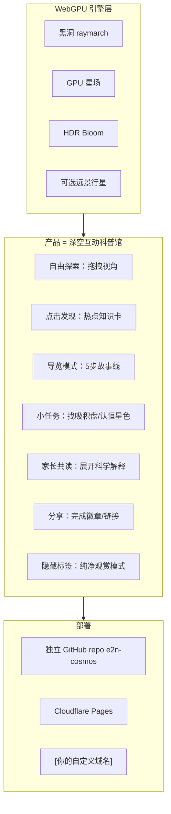
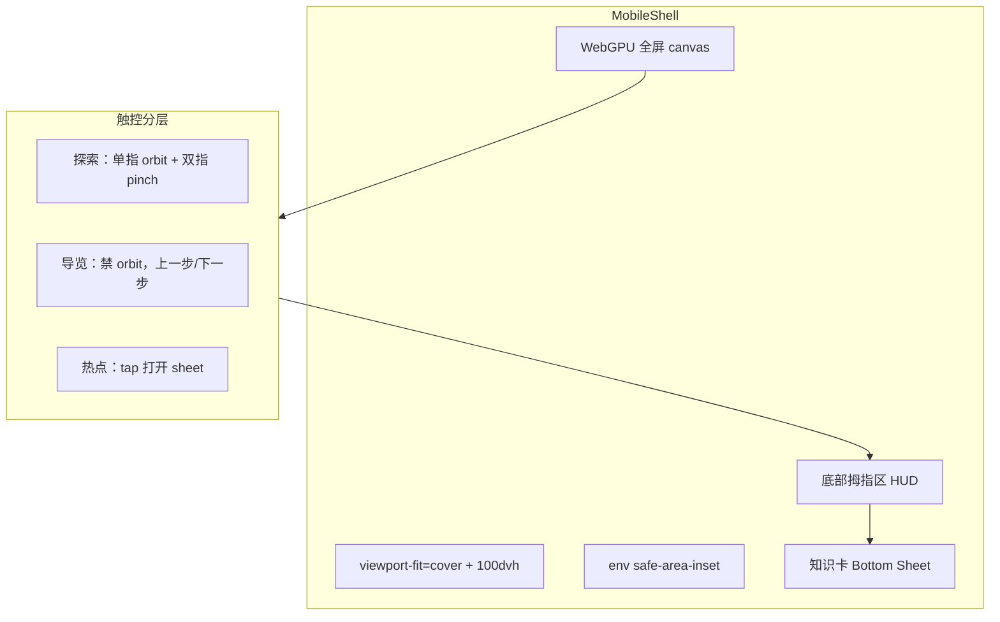
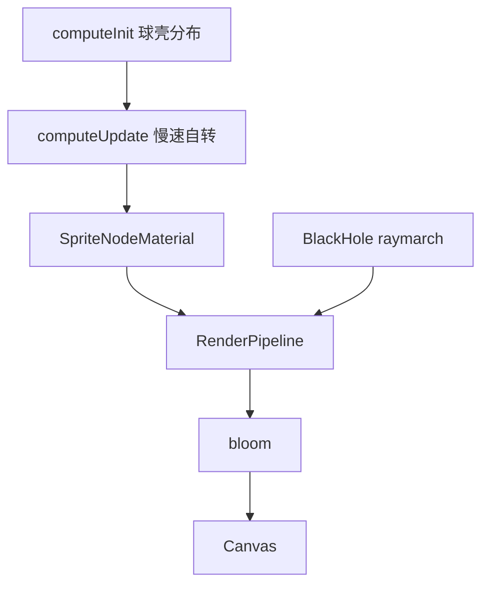
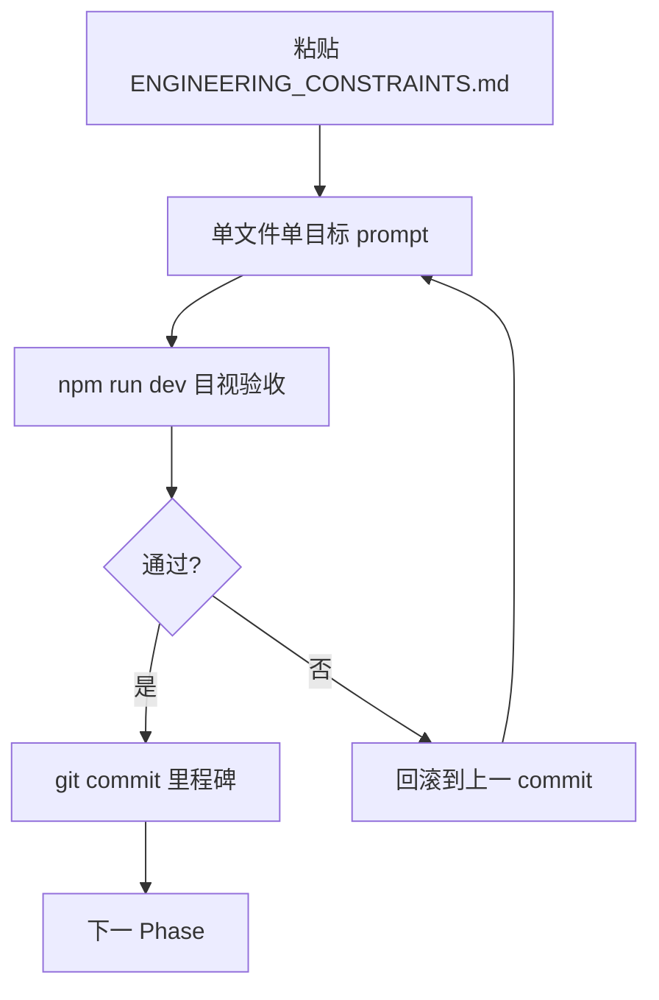

<!-- 
【文件作用与适用工具说明】
此文件是一份经过完整实战验证（Reverse-engineered）的“Vibe Coding 终极指南”。它不仅包含了项目的核心架构与业务需求，还融入了实际开发中踩坑后总结的工程约束与补丁方案。

适用工具：
- Cursor (Composer)
- Windsurf (Cascade)
- GitHub Copilot (Workspace)
- 任何支持读取多文件上下文与自主执行的 Agentic AI IDE 工具。

使用方法：
将此文件放在项目根目录或 docs 目录下，直接让 AI 读取此文件，并发送指令：“请完全按照 `深空引擎_cursor_plan.md` 的规范和步骤，为我从零开始编写整个项目。” AI 将根据这份详尽的约束和步骤，一步步精准还原具有同等完整度和专业体验的 WebGPU 互动科普项目。
-->

---
name: 深空引擎 WebGPU (Cursor 完善版)
overview: 以 Singularity 为 WebGPU 基座，独立 repo + Cloudflare Pages 部署，分 5 个技术里程碑合并星场、Bloom 与可选行星；产品定位为儿童互动天文科普（探索、导览、小任务、家长共读），非技术研究。叠加 .agents UI/UX skills 规范 overlay；全站禁止 emoji、统一天文 SVG 图标组；mobile-first 沉浸式体验与桌面同等优先级。 realistic 7–9 天。
todos:
  - id: phase0-clone
    content: Clone Singularity → 新 repo e2n-cosmos，本地 0 号检查点；记录导览机位
    status: pending
  - id: phase1-edu-layer
    content: three r183+ + 科普发现层（DiscoveryOverlay、GuidedTour、Quest、ParentMode、Share、MobileShell、DeviceProfile）
    status: pending
  - id: content-scaffold
    content: content/*.json + docs/SCIENCE_CONTENT.md + UI_UX_GUIDELINES.md + MOBILE_UX.md
    status: pending
  - id: design-tokens
    content: ckm-design-system 生成 assets/design-tokens.css（Kids Learning 配色 + Claymorphism HUD）
    status: pending
  - id: icon-system
    content: assets/icons/ 统一天文 SVG 图标组（≥12 核心图标），全站禁用 emoji
    status: pending
  - id: phase2-starfield
    content: StarfieldSystem 球壳 compute 粒子 + 恒星温度热点 +「认 3 色星」任务
    status: pending
  - id: phase3-bloom
    content: RenderPipeline + bloom() TSL 后期；移动 Bloom preset；导览 wow 验收
    status: pending
  - id: phase4-planet
    content: TSL 远景行星 + 飞近任务（勿 import WebGL procedural-planets）
    status: pending
  - id: phase5-deploy
    content: R2 HDRI、CF Pages、localStorage 进度、?tour=1 深链、fallback 展板、真机验收
    status: pending
isProject: false
---

# 深空引擎站点 — 完整实施 Plan（唯一执行文档）

> 本文档为 **唯一执行来源**，已合并技术鉴定、科普交互、SVG 规范与移动端沉浸式体验要求。

---

## 一、技术基座与选型评估

### 核心依赖与代码来源说明

| 技术选型 | 评估结论 | 实施影响 |
|------|------|------|
| `MisterPrada/singularity` 作为基座 | **推荐** — 290 stars，Live demo，Three.js + TSL + WebGPU，纯 raymarching 黑洞。 | 可作为项目的物理核心。 |
| `dgreenheck/webgpu-galaxy` 作为星场参考 | **推荐** — MIT 许可，TSL compute + `instancedArray`，含 Bloom。 | 提取其星场逻辑，但需剥离多余 UI。 |
| Three.js r183+ 版本 `RenderPipeline` | **必选项** — [PR #32789](https://github.com/mrdoob/three.js/pull/32789)，新版 API 更替。 | AI 生成后期代码时必须使用新命名，禁止使用旧版 `PostProcessing`。 |
| `dgreenheck/threejs-procedural-planets` | **不兼容** — 该项目基于 **WebGL + GLSL 字符串**，而非 TSL/WebGPU。 | 若直接 merge 会导致双渲染器地狱。行星必须用 **纯图片贴图** 或 **TSL 噪声球体**。 |
| Poly Haven HDRI 作为环境光 | **可选用** | 注意：8K EXR 体积过大，禁止打进 bundle，应通过外部 CDN 引入。 |

### Vibe Coding 的 6 个硬核大坑预警

1. **Singularity 无开源 License**（GitHub `license: null`）— 只能作学习/参考 fork；公开部署前建议给作者发 issue 要许可，或重写核心 shader（Three.js Roadmap 有完整教程可对照）。
2. **Singularity 已自带 Tweakpane + 内置 bloom/星场**（`package.json` 含 `tweakpane@4`，topics 含 `bloom`；[`Renderer.js`](https://github.com/MisterPrada/singularity/blob/master/src/Experience/Renderer.js) 直接用 `renderAsync`，非 `RenderPipeline`）— 不是「从零加 Bloom」，而是 **升级 three 版本 + 决定是否迁移 RenderPipeline**。
3. **Singularity 锁在 three `^0.180.0`（r180）** — 要用 `RenderPipeline` 需升到 **r183+**（建议 `^0.183.0` 或 `^0.184.0`），升级可能破坏现有 TSL 节点，需单独 checkpoint。
4. **与 [e2n_landingpage](file:///Users/lancelee/Desktop/e2n_landingpage) 完全无关** — 现有官网是 React + CSS 营销站，无 WebGL；独立 repo 决策正确，不会影响 e2n.studio 首页 LCP/转化。
5. **CubeCamera 性能节流大坑** — 引力透镜效果依赖隐藏的 `CubeCamera` 获取实时反射。**禁止每帧更新**！必须在 `update(deltaTime)` 循环中加入节流逻辑（例如每 3 帧更新一次），否则会造成严重卡顿；分辨率建议保持 `1024`，过低会导致背景行星边缘锯齿严重。
6. **Vite 静态资源打包陷阱** — 通过 JS 字符串动态加载的资产（如高清贴图 `2k_saturn.jpg`）不能放 `src/`，否则 Vite `npm run build` 打包时会被丢弃。必须移至公共目录 `static/` 并配置 `publicDir`，确保线上部署不报 404。

---

## 二、产品定位（已确认）



**一句话**：你的在线项目 = 浏览器里的「深空科技馆」— 小孩自己点、自己发现；家长可切换「共读模式」看稍深的解释。视觉震撼是**教具**，不是终点。

- **不是**研究 WebGPU 标准或写论文级物理模拟
- **是**儿童互动天文科普：fullscreen 体验 + 参数可调（dev）+ 部署后可分享
- **MVP 可发布点**：Phase 3 结束 — 视觉完整 + 导览 + 热点 + 任务 + 家长模式 + 分享（行星为加分项）

**科普原则**（写入 `docs/SCIENCE_CONTENT.md`）：
- 单条知识点：**1 句大白话 + 1 句类比**（如「事件视界像河流里的漩涡边缘」）
- 禁止术语堆砌；首次出现专有名词附带 **「这是什么？」** 展开
- 中文为主；8–12 岁可读，家长模式可 +2 段科学细节
- 所有文案与 `docs/ENGINEERING_CONSTRAINTS.md` 一样，每次 vibe coding 前粘贴

---

## 三、推荐项目结构

新建 repo（建议名 `e2n-cosmos` 或 `deep-space-engine`）：

```
e2n-cosmos/
├── src/
│   ├── main.js                 # 入口：async init WebGPU
│   ├── experience/
│   │   ├── Experience.js       # 从 Singularity 精简
│   │   ├── Renderer.js         # WebGPURenderer + RenderPipeline
│   │   ├── BlackHoleWorld.js   # 黑洞 raymarch（Singularity Worlds/TSL）
│   │   ├── StarfieldSystem.js  # 从 webgpu-galaxy 抽取的 compute 粒子
│   │   ├── PlanetSystem.js     # Phase 4：TSL 噪声球（可选）
│   │   ├── DeviceProfile.js    # 设备档位：starCount / pixelRatio / 特效
│   │   └── ui/
│   │       ├── LoadingScreen.js
│   │       ├── DevPanel.js              # Tweakpane，?dev=1 才显示
│   │       ├── DiscoveryOverlay.js      # 热点 + 知识卡浮层
│   │       ├── GuidedTour.js            # 5 步导览（相机 + 文案同步）
│   │       ├── QuestTracker.js          # 小任务进度条/徽章
│   │       ├── ParentModeToggle.js      # 家长共读开关
│   │       ├── ShareCompletion.js       # Web Share API / 复制链接
│   │       └── MobileShell.js           # safe-area、dvh、底部 HUD、手势路由
│   ├── content/
│   │   ├── hotspots.json
│   │   ├── tour-steps.json
│   │   ├── quests.json
│   │   └── facts.json                   # 儿童版 / 家长版双文案
│   └── shaders/                # 若 TSL 文件过长可拆分
├── assets/
│   ├── design-tokens.css       # 来自 ckm-design-system
│   ├── css/
│   │   ├── overlay.css
│   │   └── mobile.css
│   └── icons/
│       ├── sprite.svg          # 或 navigation.svg / cosmos.svg / quest.svg
│       └── ICON_MANIFEST.md
├── public/
│   └── _headers                # COOP/COEP 如需要；缓存策略
├── wrangler.toml               # Pages: pages_build_output_dir = "dist"
├── vite.config.js
├── package.json
├── docs/
│   ├── ENGINEERING_CONSTRAINTS.md
│   ├── SCIENCE_CONTENT.md
│   ├── UI_UX_GUIDELINES.md
│   ├── MOBILE_UX.md
│   └── ATTRIBUTION.md
└── README.md
```

**技术栈说明**：Singularity 为 **vanilla JS + Vite**，科普 overlay 用 **纯 HTML/CSS + GSAP**（不引入 React/shadcn，避免与 WebGPU 主循环耦合）；样式遵循 [ckm-ui-styling](.agents/skills/ckm-ui-styling/SKILL.md) 与 [ckm-design-system](.agents/skills/ckm-design-system/SKILL.md) 的 token 规范。

**工程约束**（写入 `docs/ENGINEERING_CONSTRAINTS.md`，每次 vibe coding 前粘贴）：

```markdown
# 工程约束（2026-06）

1. three >= 0.183.0；统一 `import ... from 'three/webgpu'` + `three/tsl`
2. 必须 `await renderer.init()` 后再渲染
3. 后期：`RenderPipeline`（禁止 EffectComposer / 旧 PostProcessing 名）
4. TSL 用 Fn()/uniform/instancedArray；禁止 GLSL 字符串（行星阶段亦然）
5. 粒子系统：单一 SpriteNodeMaterial + storage buffer；禁止 per-instance unique colorNode
6. 首帧：`renderer.compileAsync(scene, camera)` + loading UI；可选 `asyncCompilation: true`（r184+）
7. 部署：Cloudflare Pages 纯静态；>5MB 资产走 R2 public URL
8. 儿童模式：默认隐藏 Tweakpane；`prefers-reduced-motion` 停动画
9. 视觉专业度：全站禁止 emoji；图标仅用 assets/icons/ 统一天文 SVG 组（一致 stroke/尺寸/currentColor）
10. mobile-first：先 320–430px 布局；100dvh + viewport-fit=cover + safe-area；必读 docs/MOBILE_UX.md
11. 移动性能：DeviceProfile 分档 starCount/pixelRatio；帧率 <24fps 自动降档
12. 科普层与 WebGPU 层解耦：overlay 纯 DOM，通过 EventBus 与 Experience 通信
13. 知识卡文案只读 content/*.json，禁止硬编码在 shader 或 JS 逻辑里
14. 儿童版单卡正文 ≤ 80 字；家长扩展 ≤ 200 字
15. 分享/进度仅 localStorage；不上传个人信息
16. UI 实施前读取 docs/UI_UX_GUIDELINES.md；触控与 a11y 以 ui-ux-pro-max 为准
17. 新 UI 元素须先在 ICON_MANIFEST.md 登记图标语义，禁止临时外链图标
18. canvas 与 overlay 手势分层：导览/Sheet 打开时禁用 canvas pointer-events
19. 发热与性能红线：移动端设备强制锁定 `devicePixelRatio = 1` 并在 DeviceProfile 中自动识别降级，避免 GPU 过热发烫。
20. 统一排版与布局：控制台 (HUD) 在 PC 与移动端均需在屏幕正下方居中；小任务悬浮窗统一位于左上角；需提供“隐藏标签”切换按钮（小眼睛图标）。
```

---

## 四、`.agents` Skills 借调与视觉规范

每次做 **overlay / 科普 UI** 前，按此顺序激活：

| 顺序 | Skill | 用途 |
|------|-------|------|
| 1 | [ui-ux-pro-max](.agents/skills/ui-ux-pro-max/SKILL.md) | **Kids Learning (#152)** + **Educational App (#9)** + **Museum/Gallery (#76)**；触控 44px、reduced-motion、渐进披露 |
| 2 | [ckm-design-system](.agents/skills/ckm-design-system/SKILL.md) | 生成 `assets/design-tokens.css`（primitive→semantic→component） |
| 3 | [ckm-ui-styling](.agents/skills/ckm-ui-styling/SKILL.md) | overlay 状态、对比度、响应式 |
| 4 | [ckm-brand](.agents/skills/ckm-brand/SKILL.md) | 可选：e2n 子域 footer 品牌一致性 |
| 5 | [tailwind-responsive.md](.agents/skills/ckm-ui-styling/references/tailwind-responsive.md) | 移动端断点清单（320/640/1024；44px 触控区） |

**ui-ux-pro-max 移动端必查**（Phase 1 实施前）：
```bash
python scripts/search.py "mobile immersive fullscreen touch orbit" --domain ux
python scripts/search.py "safe-area viewport dvh reduced-motion" --domain web
python scripts/search.py "bottom sheet modal swipe dismiss" --domain ux
```

**HUD 配色**：主色 `#2563EB` + accent `#F59E0B` + 强调 `#EC4899`；卡片 Claymorphism + `backdrop-blur`（WCAG 4.5:1）；动效 soft press 200ms。

**SVG 图标组（硬约束）**：
- 全站禁止 emoji；唯一来源 `assets/icons/`
- 统一 24×24 视口、`stroke-width: 1.5`、`currentColor`、round cap/join
- 语义须天文相关；Phase 1 交付 ≥12 个核心图标
- 内联 SVG 或 sprite `<use>`；禁止 Unicode 符号冒充图标

**UI_UX_GUIDELINES.md 硬规则**：
- 可点元素 ≥ 44×44px；图标按钮 `aria-label`
- 知识卡渐进披露；导览同时仅 1 张卡
- `prefers-reduced-motion`：导览相机 instant cut
- fallback 页：静态科普海报 + 文字版导览

---

## 五、移动端沉浸式体验（与桌面同等优先级）

**mobile-first**：先设计 320–430px HUD，再扩展桌面。



| 规则 | 实现 |
|------|------|
| 全屏沉浸 | `viewport-fit=cover`；`min-height: 100dvh` |
| Safe Area | `env(safe-area-inset-*)`；主 CTA 距底部手势条 ≥ 16px |
| 拇指区 | 核心操作在底部 1/3 |
| 知识卡 | 手机 Bottom Sheet（下滑关闭）；桌面居中卡片 |
| 字体 | 正文 ≥16px；导览字幕 18–20px |
| 探索 | 单指 orbit、双指 pinch；`touch-action: none` on canvas |
| 导览 | 锁定 orbit；按钮 ≥48px |
| 冲突 | Sheet/导览打开时 canvas `pointer-events: none` |

**DeviceProfile 分档**：

| 档位 | 策略 |
|------|------|
| High | 300k 星、pixelRatio ≤2、全 Bloom |
| Mid | 80k–120k 星、pixelRatio ≤1.5 |
| Low | 40k 星、简化后期；帧率 <24fps 3s 自动降档 |

Phase 1 移动必交付：`MobileShell`、底部 HUD、Bottom Sheet、`navigator.share`、320/390/430px 验收。

---

## 六、分阶段实施（严格渐进，禁止一次让 AI 写全栈）

### Phase 0 — 基座跑通（Day 0，~2h）

```bash
git clone https://github.com/MisterPrada/singularity.git e2n-cosmos
cd e2n-cosmos && npm i && npm run dev
```

验收：
- Chrome/Edge 可见引力透镜 + 吸积盘；WebGPU backend 确认
- 记录 three 版本、首帧加载时间
- **记录 3–5 个导览机位**（供 Phase 1）

随后：复制到新 repo，去掉 obfuscate/无用插件；保留 `Experience/` 架构。

---

### Phase 1 — three 升级 + 科普发现层（Day 1–2）

```bash
npm install three@^0.183.0
```

- `PostProcessing` → `RenderPipeline`（若存在）
- 修 TSL 编译错误

**科普 UI 交付物（不可砍）**：

1. 入口：「深空探险」→ **自由探索** / **开始导览**
2. `DiscoveryOverlay`：4 热点（事件视界、吸积盘、引力透镜、背景恒星）
3. `GuidedTour`：5 步 + GSAP 相机 + 底部文案
4. `ParentModeToggle`：「告诉爸爸妈妈更多」
5. `QuestTracker`：2 任务（找吸积盘、认 3 色星）
6. `ShareCompletion`：徽章 + `navigator.share` / 复制链接
7. `MobileShell` + `DeviceProfile` 基础分档
8. `design-tokens.css` + `assets/icons/`（≥12 SVG）+ 4 份 docs

**Vibe coding prompt（Phase 1）**：
> 在 vanilla JS overlay 实现 DiscoveryOverlay + MobileShell：mobile-first 320px；Bottom Sheet 知识卡；导览锁定 orbit；读 `content/hotspots.json`；样式用 design-tokens + mobile.css；遵循 UI_UX_GUIDELINES + MOBILE_UX；不修改 BlackHole TSL。

---

### Phase 2 — GPU 背景星场（Day 2–3）

从 [webgpu-galaxy/galaxy.js](https://github.com/dgreenheck/webgpu-galaxy/blob/main/galaxy.js) 抽取，改为 **静态球壳星场**：

- `starCount` 跟 DeviceProfile 联动（150k–300k 桌面；移动 80k–120k）
- 均匀球壳 + 黑体色温（3000K–30000K）
- `renderOrder = -1`；同 scene 同 RenderPipeline
- **更新 `hotspots.json`**：「恒星颜色 = 温度」热点



验收：星场可见；MacBook >30fps；移动 Mid 档 ≥24fps。

---

### Phase 3 — RenderPipeline + Bloom（Day 3–4）

```javascript
import { RenderPipeline } from 'three/webgpu';
import { pass, bloom } from 'three/tsl';

const scenePass = pass(scene, camera);
const pipeline = new RenderPipeline(renderer);
pipeline.outputNode = scenePass.add(bloom(scenePass, 0.4, 0.6, 0.85));
```

- `renderAsync` → `pipeline.render()`
- dev 面板：bloom / exposure / 吸积盘 uniform
- 移动 Bloom preset；导览第 3 步 wow 时刻；移动先保 24fps

验收：cinematic glow；无 double tone-mapping；导览全程稳定可读。

---

### Phase 4 — 可选行星「飞近」（Day 5–6，可砍）

**不要** import `threejs-procedural-planets`（WebGL）。

| 方案 | 做法 |
|------|------|
| A 远景行星（推荐） | raymarch TSL distant sphere + 噪声 albedo |
| B 近景轨道 | MeshStandardNodeMaterial + GSAP 相机 |

儿童向选 **A**；「飞近」作为 **可选探索任务**；导览可加第 6 步「远处的世界」。

---

### Phase 5 — 资产 + 部署（Day 7–9）

**HDRI（可选）**：[Poly Haven starmap_2020](https://polyhaven.com/a/starmap_2020) → R2 `https://assets.e2n.studio/cosmos/starmap.hdr`

**Cloudflare Pages**：
```toml
name = "e2n-cosmos"
pages_build_output_dir = "dist"
```

- Build: `npm run build`；Output: `dist`
- 绑定 `[你的自定义域名]` CNAME
- `localStorage` 进度；`?tour=1` 深链
- WebGPU fallback：静态 poster + 移动 Bottom Sheet 文字导览（[ckm-banner-design](.agents/skills/ckm-banner-design/SKILL.md) 可辅助 poster）

---

## 七、Vibe Coding 节奏



**禁止**：
- 一次 prompt 写完全栈
- 混用 `three` 与 `three/webgpu`
- `EffectComposer` / GLSL `onBeforeCompile` / emoji 作图标

**推荐资源**：
- [dgreenheck/webgpu-claude-skill](https://github.com/dgreenheck/webgpu-claude-skill)
- [Three.js Roadmap 黑洞教程](https://threejsroadmap.com/blog/raytracing-a-black-hole-with-webgpu)

---

## 八、风险与降级

| 风险 | 降级方案 |
|------|----------|
| three 升级破坏 Singularity TSL | 锁 r180；Bloom 留 shader 内，跳过 RenderPipeline |
| 低端 GPU 帧率 <20 | 星数减半；关 cloud；降 pixelRatio；DeviceProfile Low 档 |
| Singularity 许可不明 | 私有演示；或按 Roadmap 重写 raymarch |
| iOS WebGPU 不稳定 | `navigator.gpu` 检测；fallback poster + Bottom Sheet 文字导览 |
| 触控与 orbit 冲突 | 导览/Sheet 打开时 canvas `pointer-events: none` |

---

## 九、与主站品牌的关系（可选，非 MVP）

- 官网 **不进主导航**
- footer 或 social 链到你的 `[深空引擎子域名]` 作彩蛋体验
- 无需 i18n / Pages Functions / 复杂后端逻辑

---

## 十、时间线与验收清单

| 天 | 里程碑 | 交付物 |
|----|--------|--------|
| 0 | Phase 0 | 本地黑洞 + 导览机位 |
| 1–2 | Phase 1 | three 升级 + 科普发现层全套 + 移动壳 |
| 2–3 | Phase 2 | GPU 星场 + 恒星科普热点 |
| 3–4 | Phase 3 | Bloom + 导览 wow 验收 |
| 5–6 | Phase 4 | 远景行星（可选）+ 导览扩展 |
| 7–9 | Phase 5 | R2 + CF Pages + 分享深链 + fallback |

### 科普体验
- [ ] 8 岁用户无需说明即可完成 5 步导览
- [ ] 4 热点均有儿童版 + 家长版文案
- [ ] 2 任务可完成并有徽章/动效反馈
- [ ] 分享链接可一键发出（或复制 toast）

### UI/UX
- [ ] 按钮触控区 ≥ 44px；知识卡对比度 ≥ 4.5:1
- [ ] `prefers-reduced-motion` 动效降级
- [ ] 全站零 emoji；图标均来自 `assets/icons/` 且风格一致

### 移动端（必过）
- [ ] 320/390/430px 无横滚；正文 ≥16px
- [ ] 底部 HUD 拇指区；主按钮 ≥48px；safe-area 无遮挡
- [ ] Bottom Sheet 可下滑关闭；导览时 orbit 锁定
- [ ] iPhone Safari + Android Chrome 完成导览；分享面板可调起
- [ ] 中端手机 ≥24fps；横竖屏切换锚点不错位

### 技术
- [ ] 生产 URL 首屏 <5s（含 compileAsync）
- [ ] 无 dev 面板、无 console 报错
- [ ] `ATTRIBUTION.md` 含 Singularity + webgpu-galaxy + Three.js
